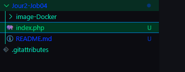
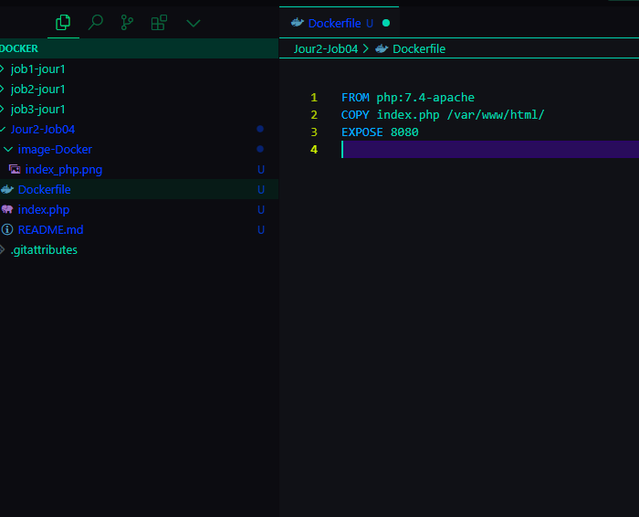
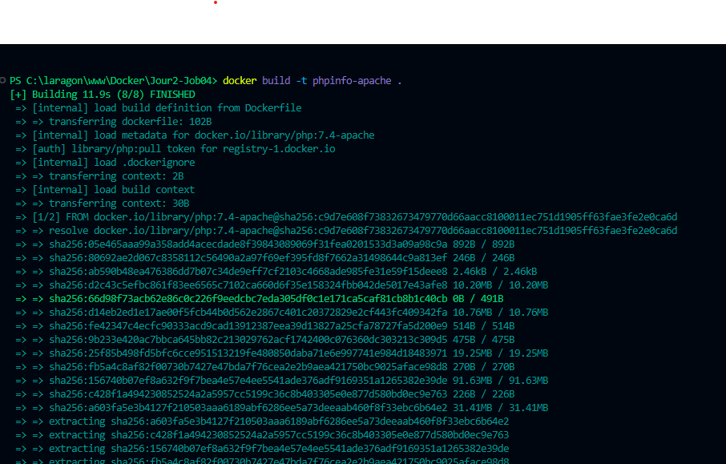
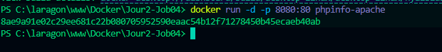
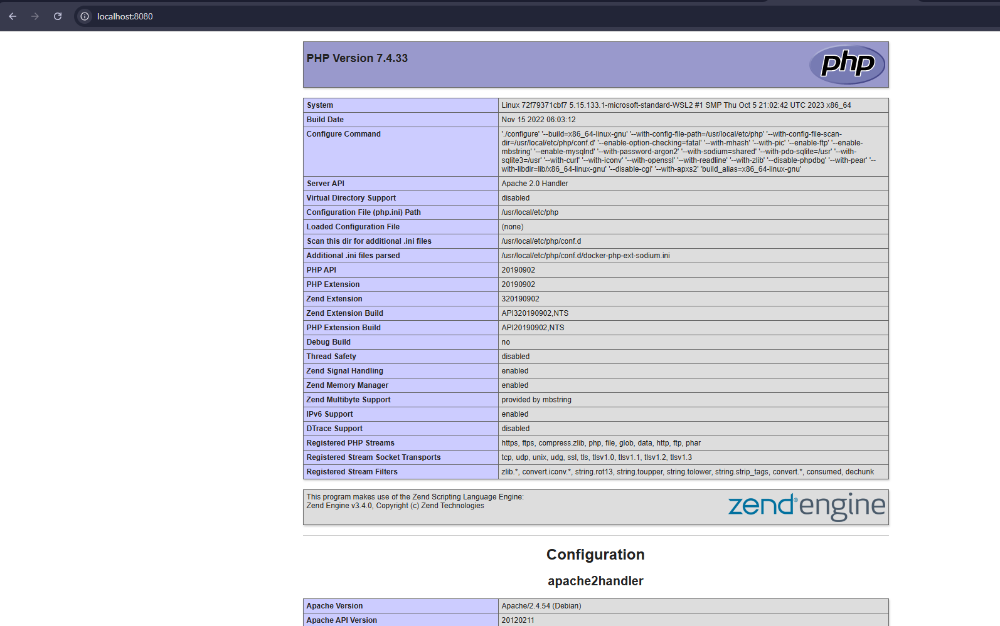
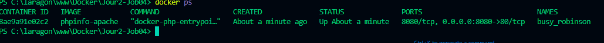
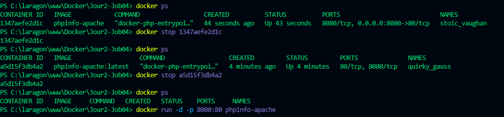

# Docker Apache avec phpinfo()

Ce projet crée une image Docker pour exécuter un serveur Apache et afficher les informations du serveur via la fonction `phpinfo()`.

## Prérequis

* Docker installé sur votre machine.

## Instructions

1. **Création du fichier `index.php` :**

   Créez un fichier `index.php` avec le code suivant :


   <?php
    phpinfo();
    ?>




2. **Création du `Dockerfile` :**

Créez un fichier `Dockerfile` avec le contenu suivant :




3. **Construction de l'image Docker :**

Exécutez la commande suivante dans le terminal :




4. **Création et démarrage du conteneur Docker :**

Exécutez la commande suivante :




5. **Accès à `phpinfo()` dans le navigateur :**

Ouvrez votre navigateur et accédez à `http://localhost:8080`.



6. **Arrêt et suppression du conteneur :**

* Listez les conteneurs :

  ```
  docker ps
  ```

  

* Arrêtez le conteneur :

  ```
  docker stop <ID_DU_CONTENEUR>
  ```

  


## Conclusion

Ce projet vous a montré comment créer une image Docker simple avec Apache et PHP, et comment afficher des informations sur le serveur.
