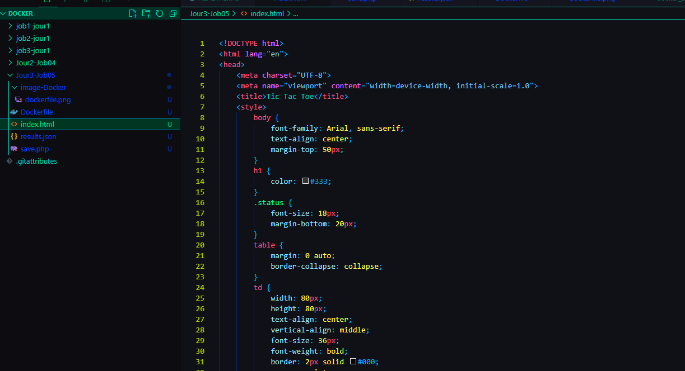
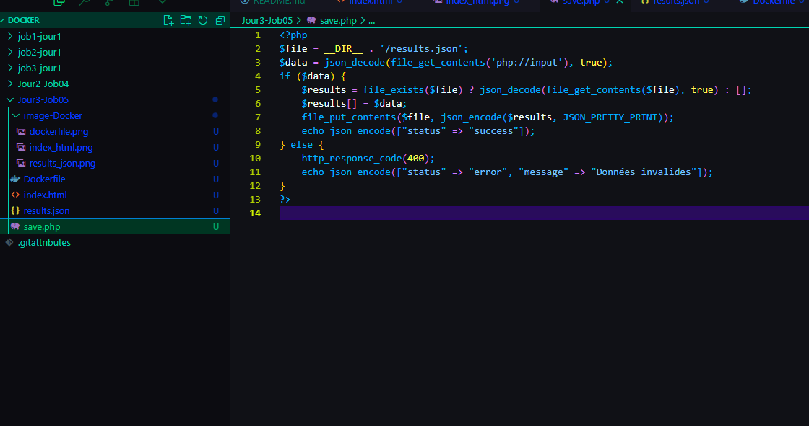
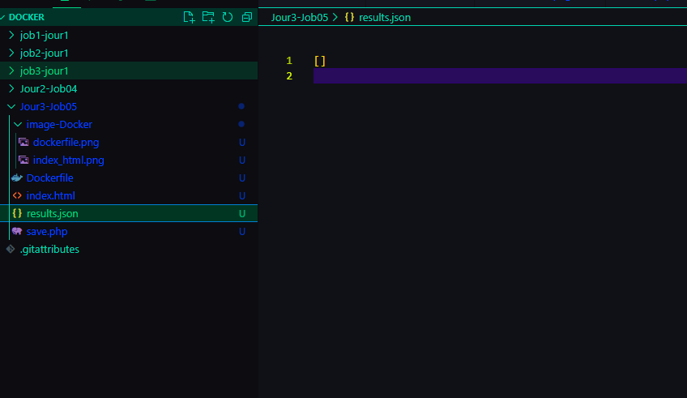
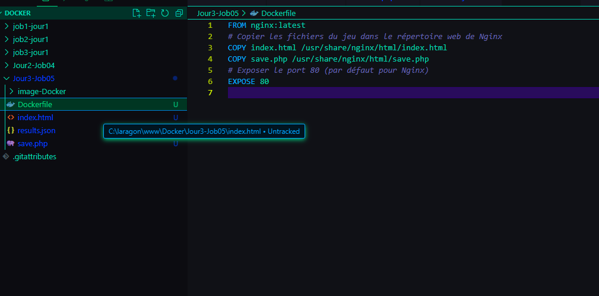
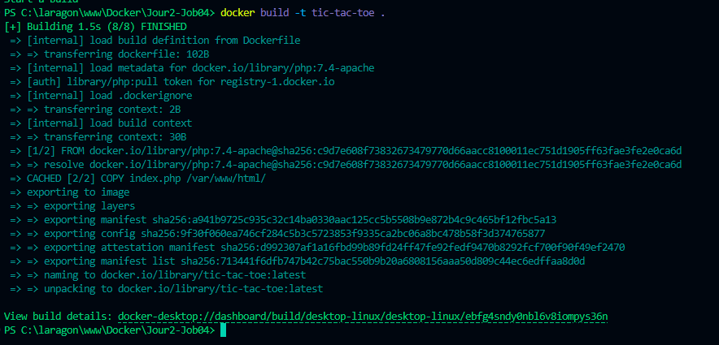
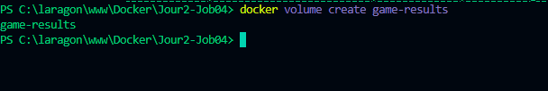
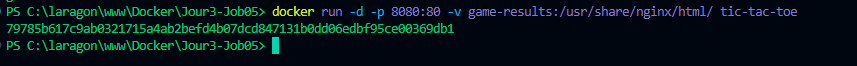
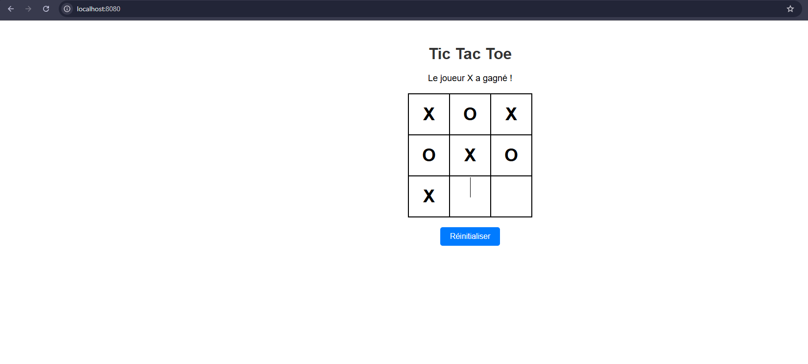
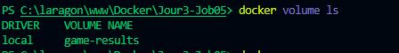
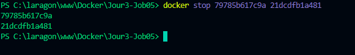

# Tic Tac Toe avec Docker et Volume

## Objectif

Ce projet crée une image Docker pour héberger un jeu de Tic Tac Toe (Morpion), en utilisant un volume Docker pour stocker les résultats des parties de manière persistante.

## Prérequis

*   Docker installé sur votre machine.

## Étapes

### 1. Préparation des fichiers du jeu

*   **Explication :** Cette étape consiste à créer les fichiers nécessaires au jeu : `index.html` (le code HTML et JavaScript du jeu), `save.php` (le script PHP qui sauvegarde les résultats), et `results.json` (initialisé avec un tableau vide pour stocker les résultats). Ces fichiers doivent être placés dans le même répertoire que le `Dockerfile`.

### 2. Création du `Dockerfile`

*   **Explication :** Le `Dockerfile` est un fichier texte qui contient les instructions pour construire l'image Docker. Dans ce cas, il utilise l'image de base `nginx:latest`, copie les fichiers du jeu dans le répertoire web de Nginx (`/usr/share/nginx/html/`), et expose le port 80.

### 3. Construction de l'image Docker

*   **Explication :** Cette capture montre la commande `docker build -t tic-tac-toe .` et son résultat. Cette commande construit l'image Docker à partir du `Dockerfile` présent dans le répertoire courant (indiqué par le `.`). L'option `-t tic-tac-toe` donne le nom "tic-tac-toe" à l'image.

### 4. Création du volume Docker

*   **Explication :** Cette capture montre la commande `docker volume create game-results` et son résultat. Cette commande crée un volume Docker nommé "game-results" qui sera utilisé pour stocker les résultats des parties de manière persistante.

### 5. Exécution du conteneur Docker

*   **Explication :** Cette capture montre la commande `docker run -d -p 8081:80 -v game-results:/usr/share/nginx/html/ tic-tac-toe` pour exécuter le conteneur Docker.
    *   `-d` : Exécute le conteneur en mode détaché (en arrière-plan).
    *   `-p 8081:80` : Mappe le port 8081 de la machine hôte au port 80 du conteneur. *Note : J'ai utilisé 8081 car le port 8080 était déjà utilisé.*
    *   `-v game-results:/usr/share/nginx/html/` : Monte le volume "game-results" dans le répertoire `/usr/share/nginx/html/` du conteneur (où Nginx sert les fichiers web).
    *   `tic-tac-toe` : Nom de l'image à utiliser pour créer le conteneur.

### 6. Accès au jeu dans le navigateur

*   **Explication :** Cette capture montre le jeu Tic Tac Toe fonctionnant dans le navigateur, accessible via `localhost:8081` (ou `localhost:8080` si vous avez pu utiliser ce port).

### 7. Vérification de la création du volume

*   **Explication :** Cette capture montre la commande `docker volume ls` et son résultat, confirmant que le volume "game-results" a bien été créé.

### 8. Affichage du contenu de `results.json`

*Note : Pour que cette étape fonctionne, vous devez d'abord jouer au moins une partie du jeu pour générer des résultats.*

Pour afficher le contenu de results.json, exécutez la commande suivante :

docker run --rm -v game-results:/data alpine cat /data/results.json

*   **Explication :** Cette commande utilise une image Alpine Linux minimaliste (`alpine`) pour afficher le contenu du fichier `results.json` situé dans le volume `game-results`.
    *   `docker run --rm` : Crée et exécute un conteneur temporaire qui sera supprimé automatiquement après l'exécution de la commande.
    *   `-v game-results:/data` : Monte le volume `game-results` dans le répertoire `/data` du conteneur.
    *   `alpine cat /data/results.json` : Exécute la commande `cat /data/results.json` à l'intérieur du conteneur, qui affiche le contenu du fichier `results.json`.
### 9. Arrêt du conteneur

*   **Explication :** Cette capture montre la commande `docker stop` utilisée pour arrêter le conteneur en cours d'exécution.

## Résultat

Voici le contenu du fichier `results.json` après avoir joué plusieurs parties :

*   **Explication :** Ce code JSON représente les résultats de trois parties du jeu. Chaque objet contient une clé `winner` qui indique le gagnant de la partie ("X", "O", ou "Draw" en cas de match nul).

**Note importante :** Si vous rencontrez des problèmes pour afficher le contenu de `results.json`, assurez-vous que :

*   Vous avez bien joué au moins une partie du jeu.
*   Le port utilisé dans la commande `docker run` correspond au port sur lequel vous accédez au jeu dans votre navigateur.
*   Le volume `game-results` est correctement monté dans le conteneur.
*   Le fichier `results.json` existe bien dans le volume.
*   Le fichier php `save.php` fonctionne correctement
*   Le lien /save dans index.html fonctionne correctement

