# Application Multi-Conteneurs avec Docker Compose

## Objectif

Ce projet déploie une application web multi-conteneurs à l'aide de Docker Compose. L'application est composée de quatre services : MySQL, Backend (Node.js), Frontend (Nginx) et Adminer. L'objectif est de configurer et de faire fonctionner l'application, de vérifier la connectivité entre les services et de gérer la base de données via une interface graphique.

## Prérequis

*   Docker installé sur votre machine.
*   Docker Compose installé sur votre machine.

## Étapes de Déploiement

### 1. Création du fichier `docker-compose.yml`

Le fichier `docker-compose.yml` définit les différents services de l'application, leurs dépendances, les ports exposés et les réseaux utilisés.

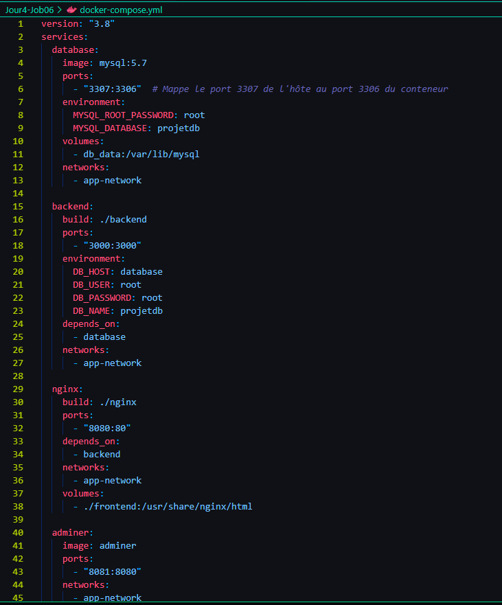


*   **Explication :** Ce fichier définit les quatre services (database, backend, nginx, adminer), leurs images Docker, les ports exposés, les variables d'environnement et les dépendances. Le port 3307 de l'hôte est mappé au port 3306 du conteneur MySQL pour éviter les conflits.

### 2. Création des fichiers pour chaque service

*   **Dossier `backend` :**
    *   `Dockerfile` :

        ```
        FROM node:16-alpine

        WORKDIR /app

        COPY package*.json ./
        RUN npm install

        COPY . .

        EXPOSE 3000
        CMD ["npm", "start"]
        ```
         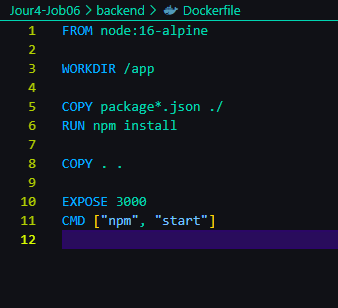
        

    *   `server.js` :

        ```
        const express = require('express');
        const mysql = require('mysql2');

        // Configuration de la base de données
        const dbConfig = {
            host: process.env.DB_HOST || 'database',
            user: process.env.DB_USER || 'root',
            password: process.env.DB_PASSWORD || 'root',
            database: process.env.DB_NAME || 'projetdb',
            port: 3306 // Utiliser le port 3306 (interne au conteneur)
        };

        let connection;

        // Fonction pour établir une connexion à la base de données
        function connectToDatabase() {
            connection = mysql.createConnection(dbConfig);

            connection.connect((err) => {
                if (err) {
                    console.error('Error connecting to database. Retrying in 5 seconds...', err);
                    setTimeout(connectToDatabase, 5000); // Réessayer après 5 secondes
                } else {
                    console.log('Connected to database');
                }
            });

            connection.on('error', (err) => {
                console.error('Database error', err);
                if (err.code === 'PROTOCOL_CONNECTION_LOST') {
                    console.log('Reconnecting to database...');
                    connectToDatabase(); // Reconnexion automatique
                } else {
                    throw err;
                }
            });
        }

        // Initialisation de la connexion à la base de données
        connectToDatabase();

        // Initialisation de l'application Express
        const app = express();

        // Route pour la racine
        app.get('/', (req, res) => {
            res.send('Bienvenue sur l\'API du backend de votre projet Docker !');
        });

        // Route de test pour vérifier le statut de l'API
        app.get('/api/status', (req, res) => {
            connection.query('SELECT NOW() AS currentTime', (err, results) => {
                if (err) {
                    console.error('Error executing query:', err);
                    res.status(500).send('Database query failed');
                } else {
                    res.json({ status: 'success', currentTime: results.currentTime });
                }
            });
        });

        // Démarrage du serveur
        const PORT = 3000;
        app.listen(PORT, () => {
            console.log(`Backend running on port ${PORT}`);
        });
        ```

        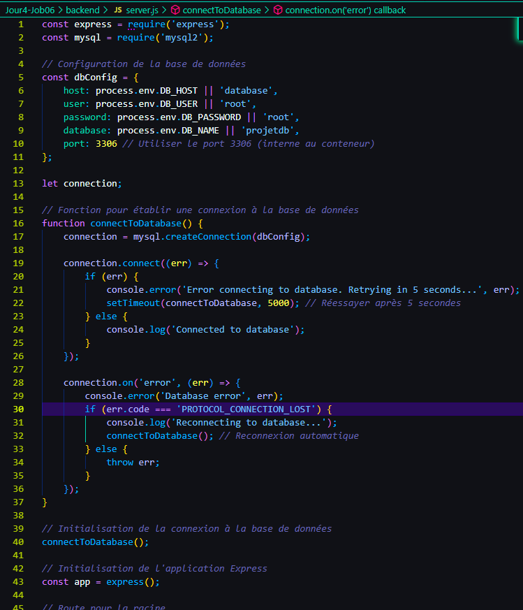

    *   `package.json` :

        ```
        {
          "name": "backend",
          "version": "1.0.0",
          "description": "",
          "main": "server.js",
          "scripts": {
            "start": "node server.js"
          },
          "dependencies": {
            "express": "^4.17.1",
            "mysql2": "^2.3.3"
          }
        }
        ```

        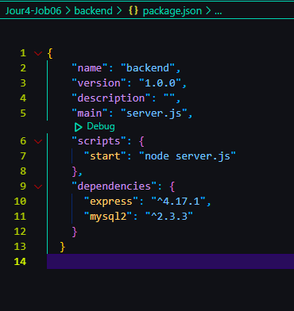

*   **Dossier `frontend` :**
    *   `index.html` :

        ```
        <!DOCTYPE html>
        <html lang="en">
        <head>
            <meta charset="UTF-8">
            <meta name="viewport" content="width=device-width, initial-scale=1.0">
            <title>Frontend</title>
        </head>
        <body>
            <h1>Bienvenue sur votre projet multi-conteneurs Docker</h1>
            <p>API status: <span id="status"></span></p>
            <script>
            // Vérifie l'état de l'API via Nginx (port 8080)
            fetch('http://localhost:8080/api/status')
                .then(response => response.json())
                .then(data => {
                    document.getElementById('status').textContent = `Success - Current time: ${data.currentTime}`;
                })
                .catch(error => {
                    document.getElementById('status').textContent = 'API inaccessible';
                });
            </script>
        </body>
        </html>
        ```

        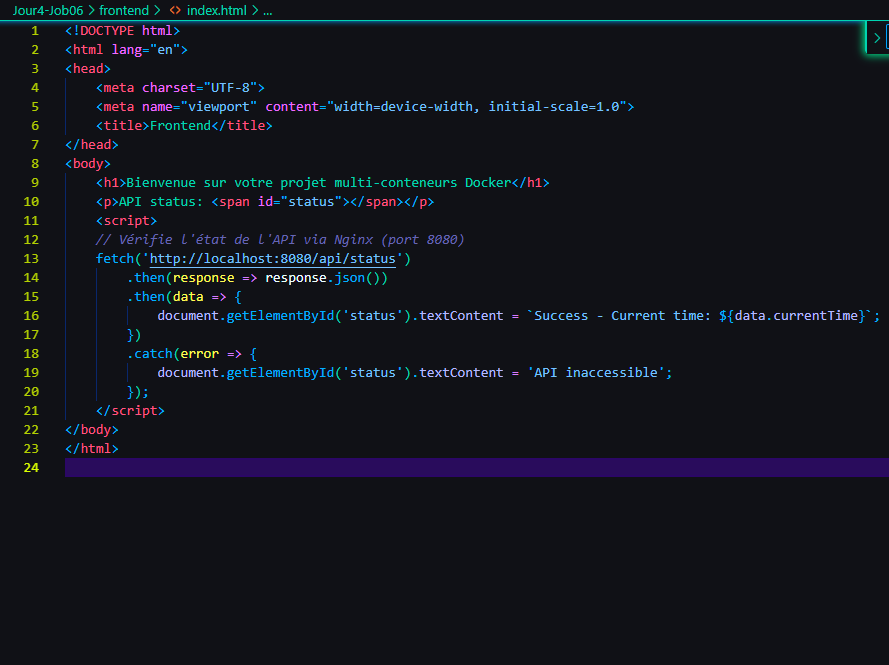

*   **Dossier `nginx` :**
    *   `nginx.conf` :

        ```
        server {
            listen 80;

            location / {
                root /usr/share/nginx/html;
                index index.html;
                try_files $uri $uri/ /index.html;
            }

            location /api/ {
                proxy_pass http://backend:3000;
                proxy_http_version 1.1;
                proxy_set_header Upgrade $http_upgrade;
                proxy_set_header Connection 'upgrade';
                proxy_set_header Host $host;
                proxy_cache_bypass $http_upgrade;
            }
        }
        ```

        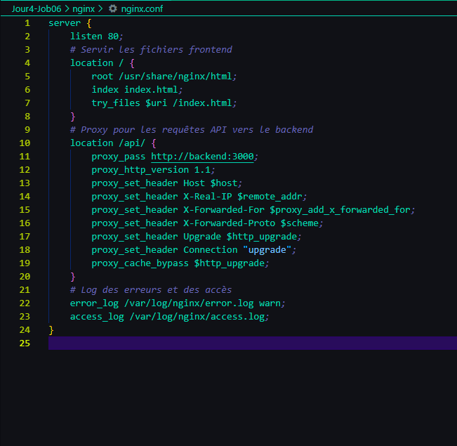

    *   `Dockerfile`:
        ```
        FROM nginx:alpine
        COPY nginx.conf /etc/nginx/conf.d/default.conf
        EXPOSE 80
        ```

        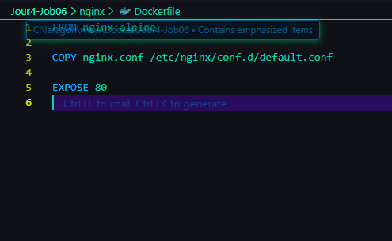

### 3. Démarrage de l'application avec Docker Compose

Exécutez la commande suivante à la racine du projet :

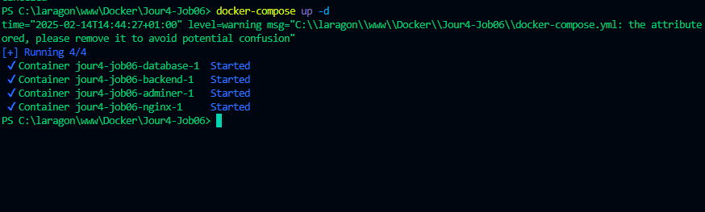


Cette commande construit les images Docker, crée les conteneurs et les démarre en mode détaché.

### 4. Vérification de l'état des conteneurs

Exécutez la commande suivante :

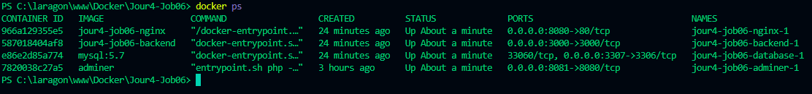


Cette commande affiche l'état des conteneurs. Assurez-vous que tous les conteneurs sont en cours d'exécution (état "Up").

### 5. Vérification de la connectivité

*   **Backend :** Accédez à `http://localhost:3000/`. 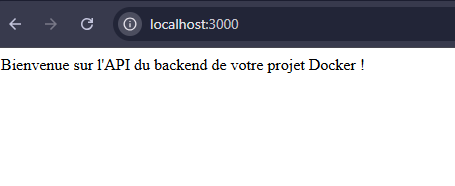
*   **API :** Accédez à `http://localhost:3000/api/status`. 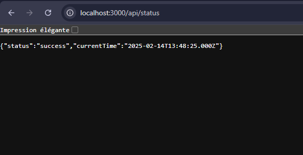
*   **Frontend :** Accédez à `http://localhost:8080/`. 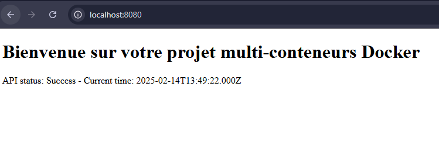
*   **Adminer :** Accédez à `http://localhost:8081/`. 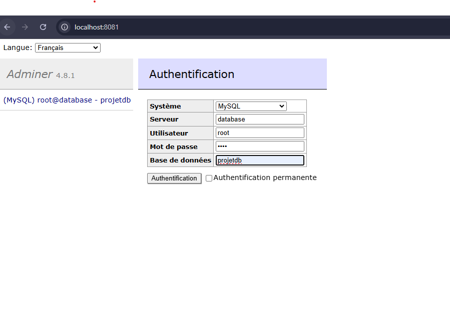

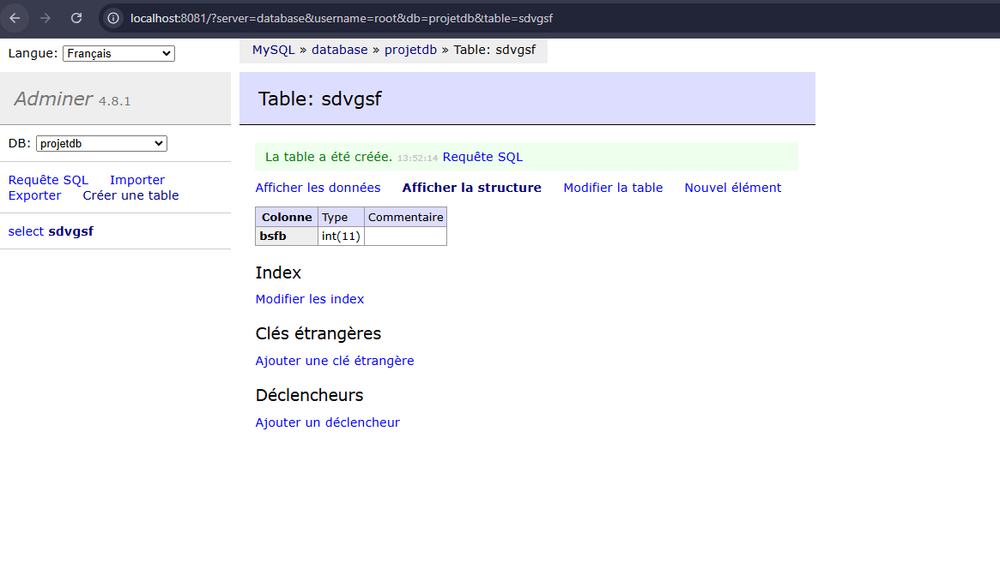

### 6. Accès à MySQL en ligne de commande

Exécutez la commande suivante pour accéder au shell MySQL à l'intérieur du conteneur `database` :


docker exec -it jour4-job06-database-1 mysql -u root -proot


*   **Note :** Remplacez `<nom_du_conteneur_database>` par le nom réel de votre conteneur database.

Une fois dans le shell MySQL, exécutez les commandes suivantes :


SHOW DATABASES;
exit


## Difficultés rencontrées et solutions apportées

*   **Conflit de port 3306 :** Le port 3306 était déjà utilisé par un autre service (Laragon). Pour résoudre ce problème, le port a été modifié à 3307 dans le fichier `docker-compose.yml` et la configuration du backend a été ajustée en conséquence.

## Conclusion

Ce projet a permis de déployer une application web multi-conteneurs avec Docker Compose, de configurer la communication entre les services et de gérer la base de données via Adminer. Les difficultés rencontrées ont permis d'acquérir une meilleure compréhension des concepts de mise en réseau et de gestion des ports dans Docker.

