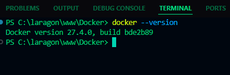
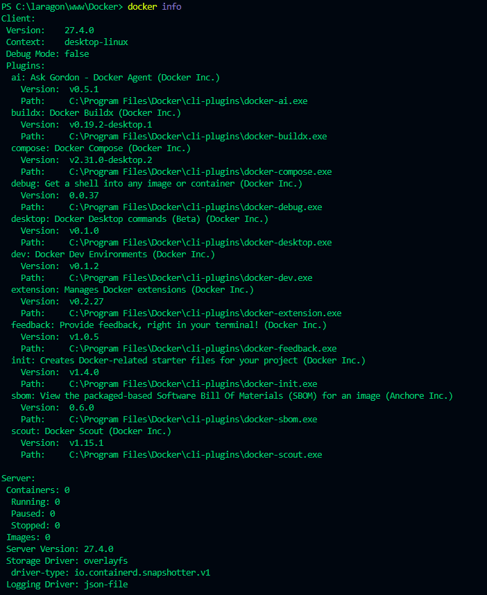
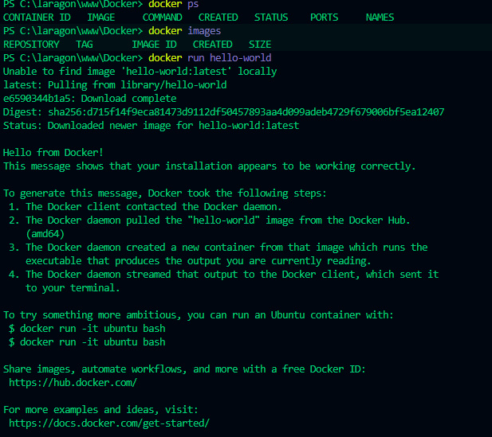
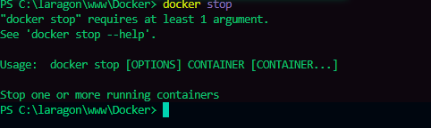
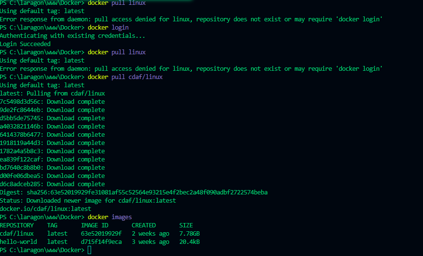

# Docker
 <!-- Tester les commandes de base dans le terminal  -->

### `docker info`

La commande `docker info` fournit des informations détaillées sur l'installation Docker, y compris la version du client et du serveur, le système d'exploitation, le nombre de conteneurs et d'images, ainsi que des informations sur le stockage et le réseau.

**Explication :**
Cette commande est utile pour vérifier l'état général de Docker et s'assurer que tous les composants fonctionnent correctement. Les informations affichées peuvent aider à diagnostiquer les problèmes potentiels et à comprendre la configuration de l'environnement Docker.

### `docker ps`

La commande `docker ps` liste les conteneurs en cours d'exécution.

**Explication :**
Dans notre cas, la commande ne renvoie rien, ce qui signifie qu'aucun conteneur n'est actuellement en cours d'exécution.

### `docker images`

La commande `docker images` liste les images Docker stockées localement.

**Explication :**
Initialement, cette commande ne renvoie rien car aucune image n'a encore été téléchargée ou créée localement.

### `docker run hello-world`

La commande `docker run hello-world` télécharge (si nécessaire) et exécute l'image `hello-world`. Cette image est conçue pour vérifier si Docker est correctement installé et configuré.

**Explication :**
Le message "Hello from Docker!" indique que l'installation de Docker fonctionne correctement. Docker a effectué les étapes suivantes :
1. Le client Docker a contacté le daemon Docker.
2. Le daemon a téléchargé l'image "hello-world" depuis Docker Hub.
3. Le daemon a créé un conteneur à partir de cette image.
4. Le conteneur a exécuté le programme qui affiche le message.

### `docker stop <container_id>`

La commande `docker stop <container_id>` arrête un conteneur en cours d'exécution.

**Explication :**
Pour utiliser cette commande, vous devez remplacer `<container_id>` par l'ID réel du conteneur que vous souhaitez arrêter. Vous pouvez obtenir l'ID du conteneur en utilisant la commande `docker ps`.

<!-- Récupérer l’image Docker -->

### `docker pull linux` (Tentative initiale)

La commande `docker pull linux` est utilisée pour télécharger une image nommée `linux` depuis Docker Hub.

**Explication :**
La tentative initiale a échoué car l'image `linux` sans nom d'utilisateur ou d'organisation spécifique n'existe pas sur Docker Hub, ou nécessite une authentification. Le message d'erreur indique "pull access denied for linux, repository does not exist or may require 'docker login'". Cela signifie que soit l'image n'est pas publique, soit le nom est incorrect.

### `docker login`

Avant de pouvoir télécharger des images privées ou des images nécessitant une authentification, il est nécessaire de se connecter à Docker Hub en utilisant la commande `docker login`.

**Explication :**
Après avoir exécuté `docker login` et fourni les informations d'identification correctes, Docker confirme la connexion avec le message "Login Succeeded".

### `docker pull linux` (Après le login)

Après s'être connecté à Docker Hub, on tente à nouveau de télécharger l'image `linux`.

**Explication :**
Même après la connexion, la commande `docker pull linux` échoue avec la même erreur. Cela confirme que l'image `linux` sans nom d'utilisateur ou d'organisation spécifique n'est pas disponible publiquement ou n'existe tout simplement pas sur Docker Hub.

### `docker pull cdaf/linux`

Pour résoudre le problème précédent, on tente de télécharger une image spécifique avec un nom d'utilisateur ou d'organisation : `cdaf/linux`.

**Explication :**
La commande `docker pull cdaf/linux` réussit à télécharger l'image depuis Docker Hub. Le processus de téléchargement affiche les différentes couches de l'image en cours de récupération. À la fin, Docker confirme que l'image est téléchargée avec le message "Downloaded newer image for cdaf/linux:latest".

### `docker images` (Après le pull de cdaf/linux)

La commande `docker images` est exécutée à nouveau pour vérifier que l'image `cdaf/linux` a bien été téléchargée.

**Explication :**
La sortie de la commande `docker images` montre maintenant deux images : `hello-world` et `cdaf/linux`. On peut voir le nom du dépôt, le tag (latest), l'ID de l'image, la date de création et la taille de chaque image.

<!-- Construisez le container Docker -->

### `docker run -it --rm -p xxxx:80 "nom de l'image"` (Commande de base)

La commande `docker run -it --rm -p xxxx:80 "nom de l'image"` est utilisée pour créer et exécuter un conteneur Docker à partir d'une image spécifique.

**Problème initial :**
La commande est incomplète et contient des espaces réservés (`xxxx` et `"nom de l'image"`) qui doivent être remplacés par des valeurs réelles.

**Explication des options :**
*   `-it` : Permet une interaction avec le conteneur (mode interactif).
*   `--rm` : Supprime automatiquement le conteneur une fois qu'il est arrêté.
*   `-p xxxx:80` : Publie le port 80 du conteneur sur un port de l'hôte (à remplacer par un numéro de port valide, par exemple 8080).

**Correction et exemple :**
Pour exécuter cette commande correctement, remplacez `xxxx` par un port valide (par exemple, 8080) et `"nom de l'image"` par le nom d'une image Docker existante (par exemple, `nginx`).

**Exemple corrigé :**
`docker run -it --rm -p 8080:80 nginx`

**Explication :**
La commande corrigée crée et démarre un conteneur Nginx. Le serveur Nginx est accessible via `http://localhost:8080` dans un navigateur web.

### Accéder au conteneur via un navigateur web

Après avoir exécuté la commande `docker run -it --rm -p 8080:80 nginx`, ouvrez un navigateur web et accédez à l'adresse `http://localhost:8080`.

**Résultat attendu :**
Si tout fonctionne correctement, vous devriez voir la page de bienvenue par défaut de Nginx.

**Explication :**
Cette étape confirme que le port a été correctement publié et que le serveur Nginx à l'intérieur du conteneur est accessible depuis votre machine hôte.

### Exemples de commandes pour supprimer :

#### Supprimer un conteneur spécifique

Pour supprimer un conteneur spécifique, utilisez la commande `docker rm <container_id>`. Remplacez `<container_id>` par l'ID du conteneur que vous souhaitez supprimer.

**Explication :**
Cette commande supprime le conteneur avec l'ID `aff4e92269b7`. Assurez-vous que le conteneur est arrêté avant de le supprimer, sinon utilisez l'option `-f` pour forcer la suppression.

#### Supprimer plusieurs conteneurs

Pour supprimer plusieurs conteneurs simultanément, spécifiez leurs IDs dans la commande `docker rm <container_id1> <container_id2> ...`.

**Explication :**
Cette commande supprime les conteneurs avec les IDs `aff4e92269b7` et `9a7d3c1f6e4a`.

#### Supprimer tous les conteneurs arrêtés

Pour supprimer tous les conteneurs qui ne sont pas en cours d'exécution, utilisez la commande `docker container prune`.

**Explication :**
Cette commande affiche un message de confirmation avant de supprimer les conteneurs arrêtés. Répondez `y` pour confirmer la suppression.

#### Forcer la suppression d'un conteneur actif

Pour forcer la suppression d'un conteneur en cours d'exécution, utilisez l'option `-f` avec la commande `docker rm -f <container_id>`.

**Explication :**
Cette commande arrête et supprime immédiatement le conteneur avec l'ID `aff4e92269b7`, même s'il est en cours d'exécution.

#### Supprimer une image spécifique

Pour supprimer une image spécifique, utilisez la commande `docker rmi <image_id>` ou `docker rmi <image_name>`.

**Explication :**
Cette commande supprime l'image avec le nom `nginx`. Si l'image est utilisée par des conteneurs, vous devrez d'abord supprimer ces conteneurs ou utiliser l'option `-f` pour forcer la suppression de l'image.

#### Supprimer plusieurs images

Pour supprimer plusieurs images simultanément, spécifiez leurs IDs ou noms dans la commande `docker rmi <image_id1> <image_id2> ...`.

**Explication :**
Cette commande supprime les images avec les noms `nginx` et `hello-world`.

#### Supprimer toutes les images inutilisées

Pour supprimer toutes les images qui ne sont pas utilisées par des conteneurs, utilisez la commande `docker image prune`.

**Explication :**
Cette commande affiche un message de confirmation avant de supprimer les images inutilisées. Répondez `y` pour confirmer la suppression.

#### Supprimer toutes les images (même celles utilisées)

Pour supprimer toutes les images, y compris celles qui sont utilisées par des conteneurs, utilisez la commande `docker image prune -a`.

**Explication :**
Cette commande affiche un message de confirmation avant de supprimer toutes les images. Répondez `y` pour confirmer la suppression.

#### Forcer la suppression d'une image

Pour forcer la suppression d'une image, utilisez l'option `-f` avec la commande `docker rmi -f <image_id>` ou `docker rmi -f <image_name>`.

**Explication :**
Cette commande supprime l'image avec le nom `nginx`, même si elle est utilisée par des conteneurs en cours d'exécution.

### Erreur présente dans les commandes initiales et correction :

