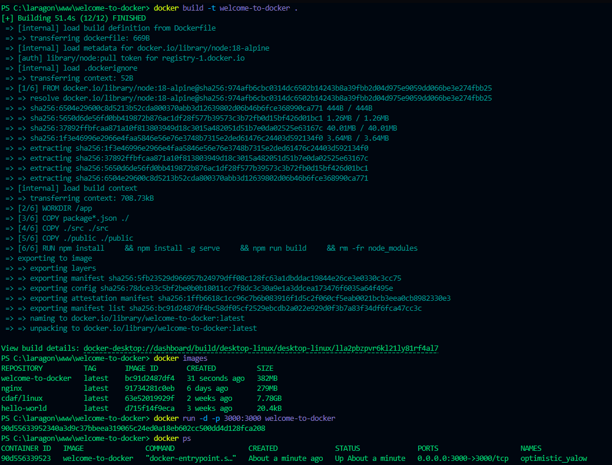

# Projet: Welcome to Docker job2

Ce projet est une introduction à Docker, basé sur le projet [welcome-to-docker](https://github.com/docker/welcome-to-docker) de Docker. Il a pour but de me familiariser avec la création, la gestion, la modification et le partage d'images Docker.

## Étapes de réalisation

### 1. Préparation du projet

*   **Action:** Clonage du dépôt GitHub `welcome-to-docker` dans Visual Studio Code.
*   **Commande:** `git clone https://github.com/docker/welcome-to-docker`
*   

### 2. Analyse du Dockerfile

*   **Action:** Examen et compréhension du fichier `Dockerfile`.
*   **Description:** Le `Dockerfile` contient les instructions pour construire l'image Docker. Il définit l'image de base, copie les fichiers nécessaires, installe les dépendances et configure l'environnement d'exécution de l'application.
*   **Extrait du Dockerfile:**

    ```
    # Insérer ici un extrait du Dockerfile (par exemple, les premières 10-15 lignes)
    ```

*   **Explication des instructions (Exemple):**
    *   `FROM node:18-alpine`: Utilise l'image Node.js version 18 basée sur Alpine Linux comme image de base.
    *   `WORKDIR /app`: Définit le répertoire de travail à `/app` à l'intérieur du conteneur.
    *   `COPY package*.json ./`: Copie les fichiers `package.json` et `package-lock.json` (s'ils existent) dans le répertoire `/app`.

### 3. Construction de l'image Docker

*   **Action:** Création de l'image Docker à partir du `Dockerfile`.
*   **Commande:** `docker build -t welcome-to-docker .`

*   **Résultat attendu:** La construction de l'image doit se terminer sans erreur. L'image nommée `welcome-to-docker` (ou `tonnomdockerhub/welcome-to-docker`) doit apparaître dans la liste des images Docker locales.
*   **Exemple de résultat:**

    ```
    [+] Building 51.4s (12/12) FINISHED
    ... (le reste du résultat de la commande) ...
    ```

### 4. Lancement du conteneur

*   **Action:** Lancement d'un conteneur à partir de l'image Docker créée.
*   **Commande:** `docker run -d -p 3000:3000 welcome-to-docker`
*   
*   **Résultat attendu:** Un ID de conteneur est affiché. La commande `docker ps` doit afficher le conteneur en cours d'exécution, avec les ports mappés correctement.
*   **Exemple de résultat:**

    ```
    90d55633952340a3d9c37bbeea319065c24ed0a18eb602cc500dd4d128fca208
    ```

### 5. Accès à l'application

*   **Action:** Vérification du bon fonctionnement de l'application dans le conteneur.
*   **Procédure:** Ouvrir un navigateur web et accéder à l'adresse `http://localhost:3000`.
*   
*   **Résultat attendu:** L'application "Welcome to Docker" doit s'afficher correctement dans le navigateur.

## Prochaines étapes

Les prochaines étapes consistent à :

*   Modifier le code source de l'application.
*   Reconstruire l'image Docker pour intégrer les modifications.
*   Relancer le conteneur avec la nouvelle image.
*   Publier l'image sur Docker Hub.
*   Récupérer l'image d'un autre membre de la promotion et la modifier.




