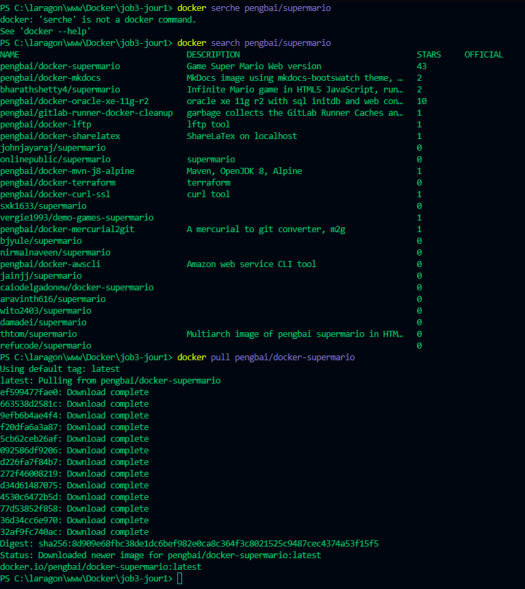
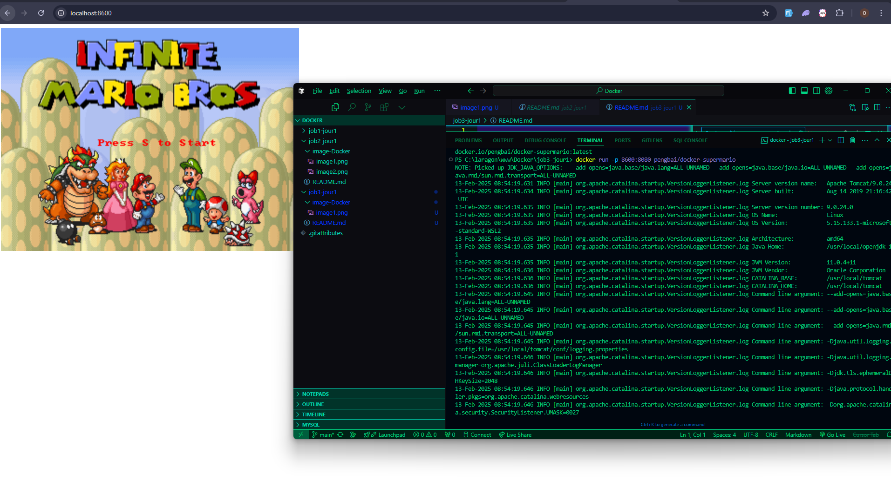
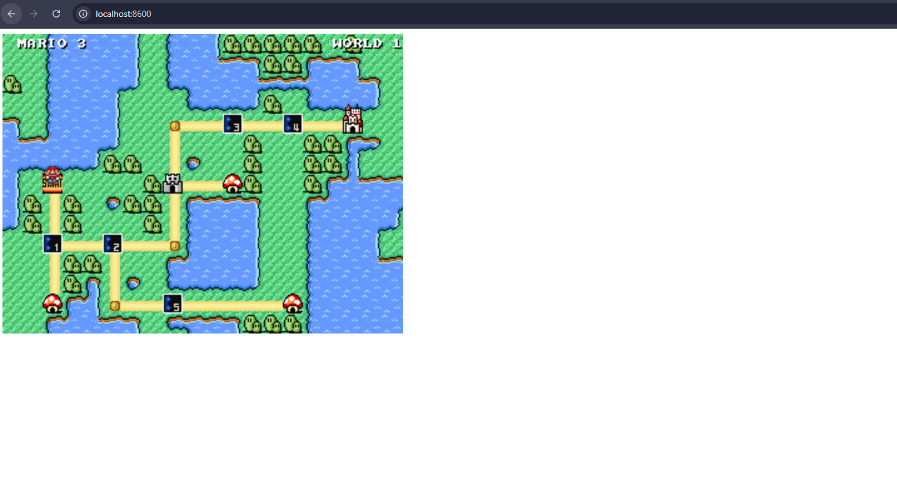
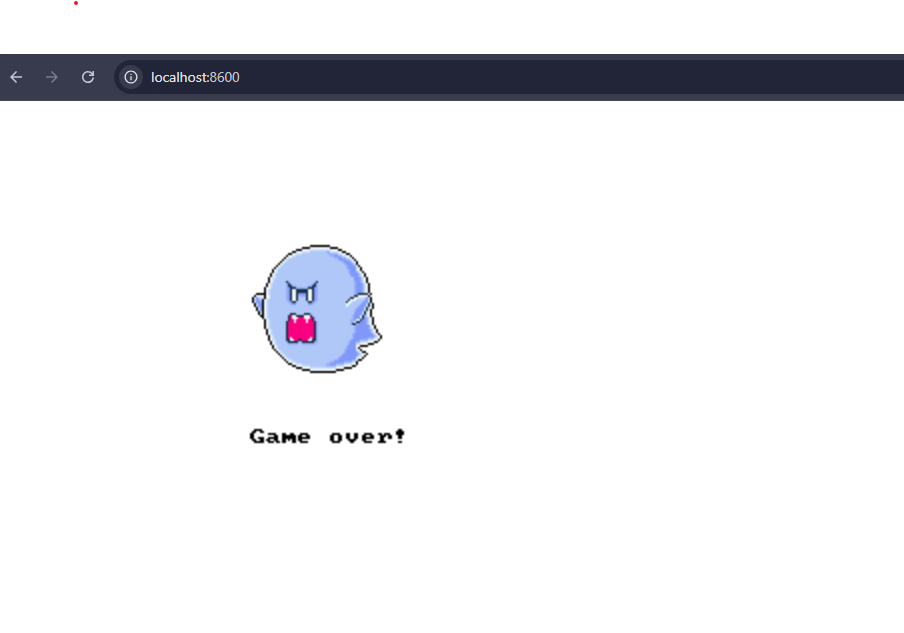
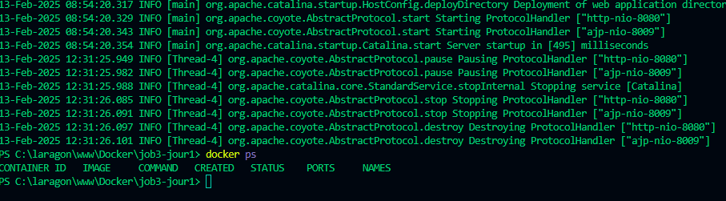

# Projet: Docker job 03

#### Téléchargement de l'image Docker

Pour télécharger l'image Docker `pengbai/docker-supermario` depuis Docker Hub, nous utilisons la commande `docker pull`. Cette commande télécharge tous les layers nécessaires pour construire l'image localement.

**Invite de commande :**




Comme le montre la capture d'écran, Docker télécharge chaque layer de l'image. Une fois le téléchargement terminé, l'image est disponible localement et peut être utilisée pour créer des conteneurs.

#### Lancement du conteneur Docker

Pour lancer un conteneur à partir de l'image `pengbai/docker-supermario`, nous utilisons la commande `docker run`. L'option `-p 8600:8080` permet de mapper le port 8600 de notre machine hôte au port 8080 du conteneur, qui est le port sur lequel le jeu Super Mario est configuré pour écouter.

**Invite de commande :**




La capture d'écran montre la commande `docker run` en cours d'exécution. Après avoir exécuté cette commande, un nouveau conteneur est créé et lancé en arrière-plan. Vous pouvez ensuite accéder au jeu Super Mario dans votre navigateur en utilisant l'URL `http://localhost:8600`.


#### Accès au jeu Super Mario dans le navigateur

Une fois le conteneur lancé, vous pouvez accéder au jeu Super Mario en ouvrant votre navigateur et en naviguant vers `http://localhost:8600`.



La capture d'écran montre le jeu Super Mario en cours d'exécution dans le navigateur. Vous pouvez maintenant jouer au jeu en utilisant votre clavier.





### 6. Arrêt du conteneur

Il est important d'arrêter le conteneur avant de le supprimer.

**Méthode 1 : Terminal**

1.  Utilisez la commande `docker ps` pour lister les conteneurs en cours d'exécution et trouver l'ID du conteneur Super Mario.

    ```
    docker ps
    ```

    *Explication :* Cette commande affiche une liste de tous les conteneurs en cours d'exécution, y compris leur ID, leur nom, l'image utilisée, et les ports exposés.

    

2.  Utilisez la commande `docker stop <ID_du_conteneur>` pour arrêter le conteneur. Remplacez `<ID_du_conteneur>` par l'ID réel du conteneur.

    ```
    docker stop <ID_du_conteneur>
    ```

    *Explication :* Cette commande envoie un signal d'arrêt au conteneur spécifié, lui demandant de s'arrêter proprement.

    

**Méthode 2 : Docker Desktop**

1.  Dans la section "Containers/Apps", sélectionnez le conteneur Super Mario.
2.  Cliquez sur le bouton "Stop".

    *Explication :* Docker Desktop offre une interface graphique pour gérer les conteneurs. Le bouton "Stop" envoie le même signal d'arrêt que la commande `docker stop`.

    
### 7. Suppression du conteneur

Une fois le conteneur arrêté, vous pouvez le supprimer.

**Méthode 1 : Terminal**

Utilisez la commande `docker rm <ID_du_conteneur>` pour supprimer le conteneur. Remplacez `<ID_du_conteneur>` par l'ID réel du conteneur.

